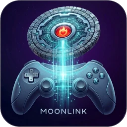

<div align="center">
  

  # MoonLink

  [](https://github.com/qiin2333/moonlight-x/releases/latest)
  [](https://developer.android.com/about/versions)
  [](LICENSE.txt)
  [](https://github.com/qiin2333/moonlight-x/stargazers)
  [](https://github.com/alexclin0188/moonlink/releases)

  **基于 [Moonlight](https://github.com/moonlight-stream/moonlight-android)/[moonlight-vplus](https://github.com/qiin2333/moonlight-vplus) 的增强版 Android 游戏串流客户端**

  [English](README_EN.md) | 中文

</div>

---

## 截图

<div align="center">
  
  <br/>
  
  <br/>
  
  
  
</div>

## 特性概览

MoonLink 是一款面向 [Sunshine](https://github.com/LizardByte/Sunshine) / NVIDIA GameStream 主机的 Android 游戏串流客户端，在完整保留上游 Moonlight 核心能力的基础上，全新设计了 UI 交互并增加了大量增强功能。

### 🎨 全新 UI 设计

| 功能 | 说明 |
|---|---|
| **Jetpack Compose 重构** | 全量使用 Material3 + Compose 构建，告别旧 XML/View 系统 |
| **自适应布局** | 竖屏 Tab 导航栏，横屏 NavigationRail 侧边栏，自动适配 |

### ⌨️ 按键映射系统

MoonLink 最强大的特性之一，完全自定义的屏幕按键映射, 更人性化的按键添加和编辑，便捷的导入导出，支持跨设备迁移按键映射方案。

**元素类型**

| 类型 | 说明 |
|---|---|
| 普通按钮 | 点击触发键盘按键 |
| 开关按钮 | 按下/抬起切换状态 |
| 可移动按钮 | 拖拽移动位置 |
| 组合键 | 一键触发多个按键（如 Ctrl+Alt+Del） |
| 方向键 (D-Pad) | 四/八方向按键 |
| 模拟摇杆 | 触控滑动模拟摇杆（可见/不可见模式） |
| 数字摇杆 | 触控滑动模拟方向键（可见/不可见模式） |

**编辑器功能**
- 拖拽放置、缩放、旋转元素
- 属性面板：按键值、文字、颜色、大小、圆角、透明度
- 颜色编辑器：正常/按下/背景/文字颜色自定义
- 组合键编辑器
- 摇杆属性编辑器（灵敏度、方向映射）
- 网格对齐辅助
- 图层管理（上移/下移）
- 复制/粘贴/重复元素

**方案管理**
- 多套按键方案
- 方案导入/导出（`.mlk` 格式文件）
- 方案搜索、重命名、删除

## 与上游 Moonlight-vplus 的区别

MoonLink 由 AI 参照 [moonlight-vplus](https://github.com/qiin2333/moonlight-vplus) 功能和 uu 远程的界面交互，使用 **Kotlin + Jetpack Compose + Material3** 从零重写了 UI 层，重要改动说明如下：

| 方面 | Moonlight-vplus | MoonLink                           |
|---|---|------------------------------------|
| **UI 框架** | XML + View 系统 | Jetpack Compose + Material3        |
| **导航架构** | Activity 跳转 | Compose Navigation 单 Activity      |
| **设备列表** | 传统 ListView | Compose LazyColumn + 动画            |
| **串流设置** | 全局 Preference | 每台主机独立设置，分类展示                      |
| **按键映射编辑器** | 旧 View 系统 Canvas | Compose Canvas + 全新交互              |
| **虚拟键盘** | 旧实现 | 全量 Compose 重写，支持 IME/快捷键/虚拟键盘/主机键盘 |
| **性能图层** | 旧 Overlay | Compose 覆盖层，更合适的展示效果               |

## 快速开始

### 系统要求

- Android 5.0+ (API 22)
- 支持 HEVC / AV1 硬解的设备（推荐）
- 局域网 5 GHz Wi-Fi 或有线连接
- 主机端：[Sunshine](https://github.com/LizardByte/Sunshine) 或 NVIDIA GameStream

### 安装

从 [Releases](https://github.com/alexclin0188/moonlink/releases/latest) 下载最新 APK，安装后按应用内引导完成配对即可。

### 从源码编译

```bash
git clone https://github.com/alexclin0188/moonlink.git
cd moonlink
./gradlew assembleRelease
```

> 如需 Release 签名，通过环境变量 `KEYSTORE_PATH`、`KEYSTORE_PASSWORD`、`KEY_ALIAS`、`KEY_PASSWORD` 传入签名信息。

### 构建并安装到设备

```bash
./gradlew installDebug
```

## 技术栈

| 技术 | 用途 |
|---|---|
| **Kotlin 2.2** | 主开发语言 |
| **Jetpack Compose + Material3** | UI 框架 |
| **Compose Navigation** | 路由导航 |
| **Compose BOM 2026.06** | 统一 Compose 版本管理 |
| **Gradle 9.6 + AGP 9.2** | 构建系统 |
| **NDK 28** | 原生库 |
| **Glide** | 图片加载（背景、封面图） |
| **Moonlight 核心库** | 串流协议、解码、输入、音频（`com.limelight`） |
| **SQLite** | 按键映射数据持久化 |
| **iPerf3** | 网络带宽测试 |

## 项目结构

```
app/src/main/java/com/alexclin/moonlink/android/
├── app/                     # Application 入口、Crash Reporter
├── device/                  # 设备详情、概览、串流设置
│   ├── detail/              #   设备详情页
│   ├── overview/            #   设备概览页 + 应用列表
│   └── streamsettings/      #   串流设置（触控/显示/主机/音频/体感/其他）
├── home/                    # 设备列表、配对、发现、封面图、小组件
├── navigation/              # 导航路由定义
├── settings/                # 全局设置（UI/手柄/输入/按键映射/连接/性能/帮助）
├── stream/                  # 串流核心引擎及 UI
│   ├── engine/              #   串流引擎、状态管理、触摸处理、USB 驱动
│   └── ui/                  #   覆盖层、编辑器、键盘、面板等
│       ├── editor/          #     按键映射编辑器（Canvas + 属性面板）
│       ├── keyboard/        #     虚拟键盘（IME/快捷键/主机键盘）
│       ├── overlay/         #     按键映射覆盖层
│       └── panels/          #     编辑器、方案选择、快捷操作
├── theme/                   # 主题、颜色、字体
├── util/                    # 工具类（分析、缓存、网络、更新等）
└── vpn/                     # VPN 功能（预留，当前版本未启用）
```

## 贡献

欢迎提交 Issue 和 Pull Request！

## 致谢

- [moonlight-vplus](https://github.com/qiin2333/moonlight-vplus) — 上游项目，功能参考
- [Moonlight Android](https://github.com/moonlight-stream/moonlight-android) — 上游项目，核心串流引擎
- [Sunshine](https://github.com/LizardByte/Sunshine) — 开源串流主机端
- [uu 远程](https://uukeji.com/) — 交互设计参考

## 许可证

本项目基于 [GPL v3](LICENSE.txt) 许可证开源。

---

<div align="center">
  <sub>觉得有用？给个 ⭐ 支持一下吧！</sub>
</div>